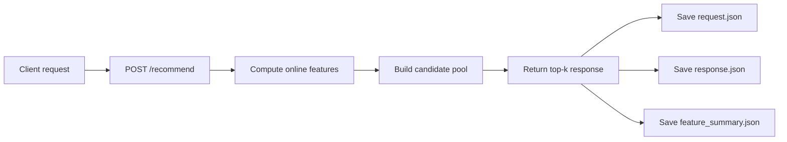

# Online Feature Pipeline Report Draft

## Requirement Addressed

This draft addresses the following course requirement:

> Online feature computation path for real time inference (does not have to be fully integrated with the open source service, but needs to be integrate-able). Video should demonstrate at least one end-to-end example.

This deliverable is intentionally separate from the traffic generator requirement. The generator simulates repeated production-like requests, while the online feature pipeline demonstrates how a single real-time request is transformed into features and then into a recommendation response.

## Goal

The goal of this implementation is to provide a minimal but concrete online inference path that:

- accepts a live recommendation request
- computes a compact set of online features from the request context
- returns a top-k recommendation response
- saves reproducible artifacts that can be shown in a demo and cited in the report

The implementation is not intended to be a full production service. Instead, it is an integrate-able reference path for real-time inference.

## Implemented Components

### 1. Mock recommendation endpoint

File:

- `src/service/mock_recommendation_server.py`

This service exposes:

- `GET /health`
- `POST /recommend`
- `POST /impression`
- `POST /outcome`

For the online feature requirement, the key endpoint is `POST /recommend`.

### 2. Online feature summary builder

File:

- `src/features/online_features.py`

This module computes a compact online-feature summary from a single request and the resulting candidate pool.

### 3. One-request online feature demo

Files:

- `src/features/online_feature_demo.py`
- `scripts/run_online_feature_demo.sh`

This demo sends one recommendation request to the mock service, captures the response, and stores request/response/feature-summary artifacts under a timestamped directory.

## Online Inference Input

The online feature path accepts a request containing:

- `user_id`
- `session_id`
- `session_track_ids`
- `session_labels`
- `seed_candidate_ids`
- `top_k`

Example request shape:

```json
{
  "user_id": 43849,
  "session_id": 9771,
  "session_track_ids": [289120, 2168411, 2118750, 3353310, 2608312],
  "session_labels": ["positive", "positive", "positive", "positive", "neutral"],
  "seed_candidate_ids": [3349857, 3349899, 2595351, 1674973, 1507453, 3830146],
  "top_k": 5
}
```

## Online Features Computed

The current minimum implementation computes the following real-time features:

- `user_known`
  Indicates whether the request is associated with a known user id.
- `prefix_len`
  Number of tracks currently present in the session prefix.
- `recent_session_tracks`
  The most recent track ids from the current session context.
- `label_counts`
  Counts of `positive`, `neutral`, `skip`, and `unknown` session labels.
- `num_seed_candidates`
  Number of seed candidates provided by the request.
- `candidate_count`
  Number of candidates used for ranking/response generation.
- `candidate_source`
  Indicates whether candidates came from request seeds or from the retriever.
- `retriever_enabled`
  Whether retriever-based candidate generation was active for this request.
- `ranker_enabled`
  Whether ranker inference was available for this request.
- `ranker_used`
  Whether reranking was actually applied to the candidate pool.

These are intentionally compact and interpretable. The goal is to demonstrate the online feature path clearly rather than to maximize model complexity.

## Current Service Behavior

The mock service supports two useful modes:

### Lightweight demo mode

Default mode:

- retriever disabled
- ranker disabled
- request-provided seed candidates used directly

This mode is stable on small Chameleon VMs and is the recommended mode for the requirement demo.

### Optional richer inference mode

The same endpoint can optionally load:

- retriever artifacts
- ranker artifacts

This shows that the design is integrate-able with richer inference logic, but these heavier modes are not required for the minimum demonstration.

## End-to-End Flow



## Repository Artifacts Produced

The online feature demo writes artifacts to:

```text
artifacts/online_feature_demo/<run_name>/
```

Expected files:

- `request.json`
- `response.json`
- `feature_summary.json`
- `demo_summary.json`

These files are the primary evidence for the requirement.

### Meaning of each artifact

- `request.json`
  The exact online inference request sent to the endpoint.
- `response.json`
  The returned recommendation response, including `top5_ids`, scores, and `online_features`.
- `feature_summary.json`
  A compact presentation-friendly summary of the request-side and response-side online features.
- `demo_summary.json`
  A simple index file pointing to the generated artifacts and the request source.

## Demo Procedure

### Step 1. Start the mock service

```bash
bash scripts/run_mock_recommendation_server.sh
```

### Step 2. Verify the service is alive

```bash
curl http://localhost:8001/health
```

Expected output:

```json
{"status":"ok","time":"..."}
```

### Step 3. Run one online feature demo request

```bash
bash scripts/run_online_feature_demo.sh
```

### Step 4. Inspect saved artifacts

```bash
find artifacts/online_feature_demo -maxdepth 2 -type f | sort
```

Then open:

- `request.json`
- `response.json`
- `feature_summary.json`

## Why This Satisfies the Requirement

This implementation satisfies the online-feature requirement because it demonstrates:

- a real request entering a callable service endpoint
- immediate feature computation from live request context
- an inference response generated from those features and candidates
- reproducible saved artifacts for external confirmation

It also satisfies the "integrate-able" condition because:

- the endpoint is already structured around a request/response interface
- retriever and ranker can be enabled without redesigning the interface
- the feature builder is separated into its own module and can be reused by a larger service later

## Example of Interpreting the Output

For a successful run, the report/demo should highlight:

- `prefix_len`
  shows how much session context was available at request time
- `recent_session_tracks`
  shows the short-term user context used for inference
- `candidate_source`
  shows whether the candidate pool came from request seeds or retriever logic
- `candidate_count`
  shows the size of the response-time candidate pool
- `top5_ids`
  shows the final recommendation output returned by the endpoint

This makes the data path easy to explain during a presentation:

1. a user/session request arrives
2. online features are computed immediately
3. a candidate set is assembled
4. top-k recommendations are returned

## Current Scope and Intentional Limitations

This is a minimum initial implementation, so several things are intentionally lightweight:

- the service is local rather than publicly deployed
- the default mode uses seed candidates directly instead of requiring full retriever/ranker loading
- the online feature set is compact and interpretable, not exhaustive
- the pipeline demonstrates one end-to-end inference example rather than high-throughput serving

These limitations are acceptable for the requirement because the course asks for an integrate-able online feature path, not a production-hardened service deployment.

## Suggested Evidence for Slides or Video

The most useful outputs to show are:

1. `curl http://localhost:8001/health`
2. `bash scripts/run_online_feature_demo.sh`
3. `cat artifacts/online_feature_demo/<run_name>/feature_summary.json`
4. `cat artifacts/online_feature_demo/<run_name>/response.json`

If only one artifact is shown on slides, `feature_summary.json` is the best choice because it summarizes both the request context and the response-side online features.

## Short Report Paragraph

We implemented a minimal online feature computation path for real-time inference using a mock recommendation service and a one-request demo runner. The service accepts a live recommendation request containing user, session, and seed-candidate context, computes compact online features such as session prefix length, recent session tracks, label counts, and candidate-pool metadata, and returns a top-k response. The demo saves reproducible artifacts including the request, response, and feature summary under a timestamped output directory. Although lightweight, the implementation is integrate-able with richer retriever and ranker logic and directly satisfies the requirement of demonstrating at least one end-to-end online inference example.
